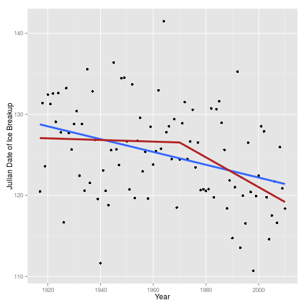

River Ice Explorer App
========================================================
author: Tomás E. Tecce
date: January 31, 2016

Introduction
========================================================

Available data suggests that regions in the far north of the Earth are
warming more quickly than other parts of the world. We can explore this
situation using ice breakup data available for some rivers in Alaska, USA.

- Local citizens have been recording ice breakup data for the Nenana River
since 1917
- Ice breakup is an important time of transition for communities that rely
on these rivers for transportation, subsistence hunting and fishing, and
other needs
- Early thawing can lead to severe ice movement, jamming, damage to
infrastructure, and destructive floods

The River Ice Explorer App
========================================================

With this app you can explore the Nenana River ice breakup data for any
range of years from 1917 to 2010. You can:

- **Browse the data**: sort by columns, search
- **Plot the data**
- **Fit two types of models**:
  + simple linear model
  + segmented linear model *(to explore possible shifts in the trends)*
- **Compare the results** of the fits to select the best model

Explore Data and Fit Models
========================================================

 

***

Available data contains ice breakup dates (Julian dates) for all years
between 1917 and 2010.

The app allows you to select a range of years, plot the data and fit
linear (*blue*) and segmented (*red*) models. In the latter case, you can
specify the break point (1970 in this example).

Compare Models
========================================================


```

Model selection based on AICc :

          K   AICc Delta_AICc AICcWt Cum.Wt      LL
Segmented 4 594.36       0.00   0.72   0.72 -292.95
Linear    3 596.21       1.86   0.28   1.00 -294.97
```

The app prints the summaries of the fitted models. Additionally, if two
models are selected, you can compare them based on the AIC.

In this example, **the segmented model gets first place** (the output is
always sorted to show the lower AIC model first). 
